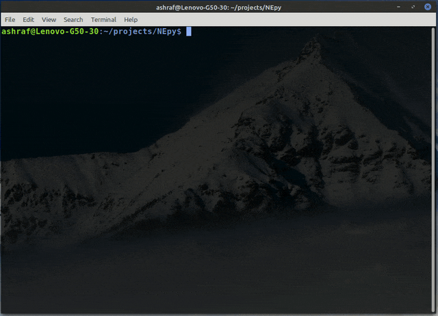

# A Subnet Calculator written in Python

This command-line Python program is my attempt to calculate subnet values. It calculates total number of hosts that can be present in the given subnet, its Network Address, Broadcast Address and First & Last Valid Host IP Addresses. Additionally it displays appropriate messages for a /31 and discontinuous masks.

***

## PRE-REQUISITES

The only pre-requisite for this program is to have Python 3 installed on the system. Python 3 can be installed from its official website www.python.org

***

## FEATURES

1. Takes user input for IP & Subnet Mask values
2. Validates the user input using regex
3. Checks if the mask is continuous or discontinuous [currently this program only calculates subnet values for continuous masks]
4. Calculates subnet values after converting the user input into binary
5. Displays the values for `total no. of hosts`, `network address`, `broadcast address`, `first host ip` and `last host ip` in the given subnet
6. Displays appropriate message for /31 & /32 subnet masks.

***

## A Demo showing the working of the program

